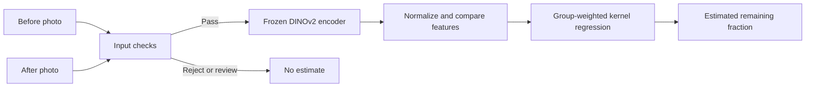

# Aftermeal — Food Leftover Estimation

Estimate the fraction of food remaining from **before-and-after meal photos**. Aftermeal combines a frozen DINOv2 image encoder with a compact regression model, an interactive local demo, and a reproducible benchmark on **1,316 photo pairs**.

## Release

The base release is complete locally. The main gallery contains Rice, Tempeh and Tofu; a difficult fourth pair is available under **Accuracy → A difficult example**. The screen keeps photos, highlights and the result together. Analyze, Accuracy and About share one page and preserve the active photos. The difficult example expands inside Accuracy without changing the workspace.

The public service runs the four sample predictions without PyTorch, a GPU or model downloads. Personal photo analysis and data collection remain local tools. See [deployment](docs/DEPLOY.md), [verified release checks](docs/RELEASE.md). No public application URL is configured.

```bash
python -m pip install -r requirements-public.txt
python -m gunicorn --config gunicorn.conf.py --bind 127.0.0.1:8080 'foodvision.public:create_app()'
```

Use the Python 3.12 environment described below. Open http://127.0.0.1:8080 for the public-mode preview.

## Try it

Use Python 3.12. From this directory:

```bash
python3.12 -m venv .venv
source .venv/bin/activate
python -m pip install -r requirements.txt
python -m foodvision demo
```

Open **http://127.0.0.1:8765**. Four held-out examples work immediately, including a difficult pair where the model is substantially wrong. Their predictions are computed from bundled image embeddings, so trying examples needs no model download. A switchable blue overlay shows the experimental segmentation model’s food predictions. These cached masks can highlight stains and do not drive the percentage estimate; uploaded photos can also generate highlights when the optional segmentation dependencies and weights are installed. Recorded weight ratios and prediction errors appear next to each sample result.

Developer tool, separate from the product: use **http://127.0.0.1:8765/capture** to start the ten-serving weighed pilot. It saves photos, empty-plate/food scale readings and correction history locally, keeps pilot and reserved evaluation sessions separate, and exports a ZIP with photos and measurement provenance. See [the capture procedure](docs/CAPTURE.md). Collection does not retrain or change the estimator.

To analyze new photographs, install the image encoder dependencies:

```bash
python -m pip install -r requirements-images.txt
python -m foodvision demo
```

Choose or drag in two photos, then select Analyze pair. No manual food-presence answer is required. The app still checks image validity, duplicate photos and known starting-image source flags. This is not automatic empty-plate detection. First valid use downloads the pinned DINOv2 code and pretrained weights from Meta through PyTorch Hub. Later runs use the local cache. Workspace analysis photos are processed in memory on your computer and are not saved or sent to external services. The separate Collect data workflow explicitly saves its photos locally.

For food highlighting on uploaded photos, install `requirements-segmentation.txt` and the pinned checkpoint described in [the experiment setup](docs/EXPERIMENTS.md), then restart the demo in that environment. In **Your photos**, choose both images and Analyze pair with **Show food highlight** enabled. The mask is generated locally from the uploaded images; toggling the control switches between originals and highlights. Highlight failures do not replace or change percentage predictions.

For command-line inference:

```bash
python -m foodvision predict --before before.jpg --after after.jpg
```

Use photos of the same serving with similar framing. JPEG and PNG inputs are supported, at least 224 pixels on both sides, up to 8 MB and 20 megapixels per photo. CPU inference is supported; a GPU is not required. [Input checks, API responses and review storage](docs/RELIABILITY.md).

## Reproduce the benchmark

```bash
python -m foodvision verify
python -m foodvision benchmark --output reports/my-benchmark.json
python -m unittest discover -s tests -v
```

The benchmark includes the features, labels, partitions and reference predictions it needs. It refits the regressors and reruns inner validation; it does not merely display the saved results. Existing output files are never overwritten.

**Group-balanced mean absolute error, in percentage points; lower is better:**

| Method | LeFood: 524 pairs | ACETADA: 792 pairs |
|---|---:|---:|
| Group-weighted mean | 39.69 | 10.86 |
| Group-weighted median | 40.15 | 10.36 |
| Appearance features | 14.65 | **9.08** |
| Before/after change features | **9.63** | 9.46 |

This compact benchmark uses five outer folds per collection, one fixed calibration repetition, and 50 labeled pairs per fit. Appearance and Change each search 25 candidates using inner validation only. Food-category or participant groups and reviewed similar images are separated at fitting boundaries. The implementation checks those boundaries before fitting.

Change features improve LeFood error by **5.01 percentage points**, while slightly worsening ACETADA error. That contrast is central to the project: a representation that helps one image collection may not help another. These are within-collection calibration results, not evidence of cross-collection transfer or performance on new institutions. The single repetition is a compact demonstration, not a comprehensive uncertainty analysis.

The exact output is in [reports/benchmark.json](reports/benchmark.json). The benchmark starts from cached DINOv2 embeddings; it does not retrain the image encoder or the separate CNN experiments from the wider research workspace.

## Accuracy development

The [accuracy audit](docs/ACCURACY.md) reproduces fresh-photo failures, checks original image/weight mappings, and compares the existing feature types. It finds both model errors and suspected source image/label inconsistencies. The original benchmark and deployed model remain unchanged.

```bash
python -m foodvision diagnose --output reports/my-diagnostics.json
```

This refits the existing models and reports zero-mass and small-positive failure slices with per-record held-out predictions. These are development diagnostics, not a new final test.

The [completed segmentation comparison and AI review](docs/EXPERIMENTS.md) cover all 524 LeFood pairs. The first segmentation model increased error (9.63 pp baseline versus 15.82 pp segmentation and 11.94 pp combined), so the demo retains its original estimator. The developer-only **Review lab** at `http://127.0.0.1:8765/lab` supports image inspection, experimental overlays, browser-local visual reviews and provenance-bearing JSON export. There are 48 AI-flagged review priorities; none is automatically treated as a corrected weight or gold label.

Save a Review lab export as `reviews.json`, then preserve it in local SQLite history:

```bash
python -m foodvision import-reviews --input reviews.json
python -m foodvision review-status
```

Imports validate both image hashes and the evidence version, commit atomically, deduplicate retries, and retain earlier revisions. The database defaults to ignored `.local/reviews.sqlite3`. Visual reviews do not alter source weights or certify evaluation labels.

## How it works



The target is `mass_after / mass_before`. The benchmark compares after-only and concatenated appearance features with vector and cosine changes. Hyperparameters are selected using grouped inner validation. Every candidate is refitted on the available calibration labels before the outer test is scored.

The demo uses the cosine-change model selected within one fixed LeFood fold, calibrated on 50 pairs. It retains that fold’s held-out examples instead of retraining on them. [Model details and input requirements](docs/MODEL.md).

## Project layout

| Path | Purpose |
|---|---|
| `foodvision/features.py` | Image normalization and paired representations |
| `foodvision/models.py` | Candidate models, weighting and kernel fits |
| `foodvision/selection.py` | Split checks and inner-only model selection |
| `foodvision/benchmark.py` | Refit, score and compare reference predictions |
| `foodvision/inference.py` | Compact regression head and new-photo encoding |
| `foodvision/input_checks.py`, `foodvision/reviews.py` | Upload checks and transactional annotation history |
| `foodvision/server.py`, `web/` | Local API and responsive browser demo |
| `data/`, `models/`, `examples/` | Inputs needed for the included benchmark and demo |
| `tests/` | Leakage, numerical, packaging and API checks |

## What the estimate means

- It predicts a remaining-mass fraction, not grams from a photograph alone. A gram estimate would also require a known starting mass.
- The model is calibrated to one dataset. Backgrounds, framing, liquids, mixed dishes and unfamiliar foods can cause large errors; the sample gallery includes a failure case.
- It does not provide a calibrated confidence score, measure avoidable waste, or establish environmental savings.
- Released targets above one were retained. Predictions use the existing evaluation range of 0–1.25, so an estimate can exceed 100%; that is model behavior, not evidence that a meal gained mass.

## Data and attribution

The sample photographs come from **LeFood-Set v1**, by Yuita Arum Sari, Yudi Arimba Wani and Atsushi Nakazawa, licensed under [CC BY 4.0](https://creativecommons.org/licenses/by/4.0/). The benchmark also contains features derived from **ACETADA**, whose dataset license is [CC BY-NC 4.0](https://creativecommons.org/licenses/by-nc/4.0/). These data assets retain their source terms and are separate from the code license. See [data sources and transformations](docs/DATA.md).

The new-photo encoder is [Meta’s DINOv2](https://github.com/facebookresearch/dinov2), pinned to the revision and weight checksum in `models/demo_model.json`. Encoder weights are downloaded separately, not bundled here.

The release also checks missing/modified benchmark inputs and EXIF orientation. Run `python -m unittest discover -s tests -v` to execute all 89 checks.
