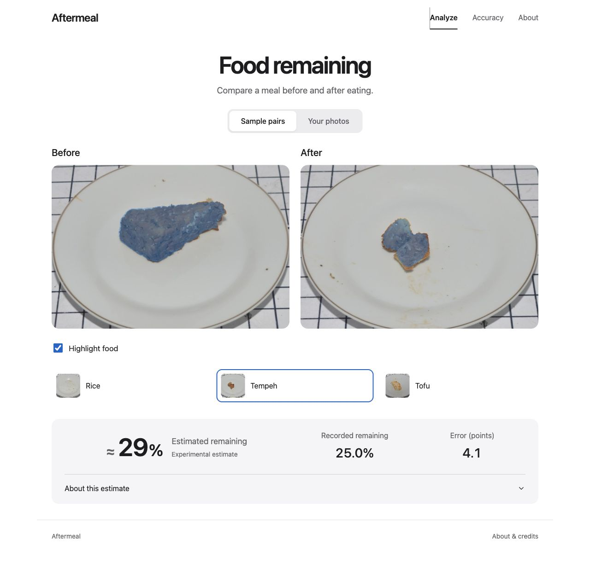

# Aftermeal

Estimate the percentage of food remaining from before-and-after meal photos.

**[Try Aftermeal](https://aftermeal.onrender.com)**

## Use it

Select **Your photos**, add a before and after photo of the same serving, and click **Analyze pair**. Use similar framing and lighting. The app accepts JPG and PNG files up to 8 MB each and resizes large images before upload. Photos are processed on the server without being saved.

**Sample pairs** includes Rice, Tempeh and Tofu, with recorded weights and prediction errors. Sample photos also have a food-highlight toggle. Highlights aren't available for your own uploads.

The free Render instance sleeps when idle, so the first visit can take about a minute to load.

## Model

A frozen DINOv2 ViT-S/14 encoder produces an embedding for each photo. A kernel regressor uses the change between them to estimate `mass_after / mass_before`. The deployed model was calibrated on 50 LeFood pairs and runs on CPU through ONNX Runtime.

The estimate can be unreliable on unfamiliar foods, lighting or camera angles. [Model details](docs/MODEL.md).

## Results

Group-balanced mean absolute error, in percentage points:

| Method | LeFood · 524 pairs | ACETADA · 792 pairs |
|---|---:|---:|
| Mean baseline | 39.69 | 10.86 |
| Median baseline | 40.15 | 10.36 |
| Appearance features | 14.65 | **9.08** |
| Before/after change | **9.63** | 9.46 |

Five outer folds per dataset use 50 calibration labels per fit. Model selection uses inner folds, with food or participant groups kept separate. These results measure performance within the two datasets; accuracy on new phone photos hasn't been measured.

Segmentation and depth features increased LeFood error, so the deployed estimator keeps the simpler change feature. See the [failure analysis](docs/ACCURACY.md), [segmentation results](docs/EXPERIMENTS.md) and [depth results](docs/DEPTH.md).

## Development

The repository includes the website, inference service, tests, cached benchmark inputs and experiment reports.

- [Setup and tests](docs/DEVELOPMENT.md)
- [Deployment and API](docs/DEPLOY.md)
- [Input validation](docs/RELIABILITY.md)
- [Release checks](docs/RELEASE.md)

| Directory | Contents |
|---|---|
| `web/` | Browser interface |
| `foodvision/` | Inference, API and evaluation code |
| `data/`, `models/`, `examples/` | Benchmark inputs, fitted regressor and sample photos |
| `reports/` | Predictions, diagnostics and experiment results |
| `tests/` | Numerical, data, storage and API tests |

## Credits

Sample photos are from **LeFood-Set v1**, by Yuita Arum Sari, Yudi Arimba Wani and Atsushi Nakazawa, under [CC BY 4.0](https://creativecommons.org/licenses/by/4.0/). ACETADA-derived features retain [CC BY-NC 4.0](https://creativecommons.org/licenses/by-nc/4.0/). Code is MIT-licensed. [Data attribution](docs/DATA.md).

The image encoder is [Meta's DINOv2](https://github.com/facebookresearch/dinov2). Its revision and weight checksum are pinned in `models/demo_model.json`; the Docker build downloads and exports it.
