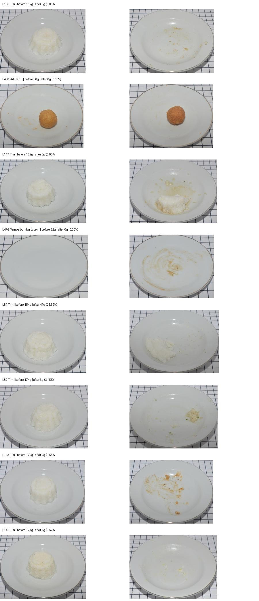

# Accuracy audit and next experiment

**Recommendation: retain the mass-estimation target as experimental, audit the image/weight labels, then compare image features, food-mask features, and their combination.** A category pivot or replacement architecture has not been selected. No segmentation model was trained or integrated in this audit.

## What was reproduced

- All 19 pre-existing tests passed. After adding diagnostic checks, all 24 tests passed.
- The complete 1,316-pair benchmark was refitted and matched its reference predictions within the existing `1e-10` tolerance. [Fresh baseline report](../reports/baseline-recheck.json).
- The running browser demo displayed 4.2% for L133. Fresh CPU encoding of six raw pairs reproduced their cached forecasts within **0.000314 percentage points**. This is a model/data issue, not a stale sample forecast. [Photo results](../reports/new-photo-recheck.json).
- All 524 packaged LeFood pairs matched the original spreadsheet's names, weights, food groups and row references. All 1,048 referenced image files matched the original extraction's SHA-256 hashes. This verifies the import, not the physical correctness of source labels. [Source audit](../reports/source-audit/source-audit.json).

The diagnostic command refits the existing candidate models and uses the original nested grouped selection. It does not select a new deployment model or alter any training labels.

```bash
python -m foodvision diagnose --output reports/my-diagnostics.json
```

## Measured failure slices

**Group-balanced mean absolute error, percentage points.** These are mass-label slices for diagnosis, not proposed UI categories. The Change bank is the existing benchmark method; its fitted model differs by fold and source. The deployed model is the single LeFood fold-0 fit.

| Source and recorded mass slice | Pairs / groups | Change | Appearance |
|---|---:|---:|---:|
| LeFood, all | 524 / 34 | 9.63 | 14.65 |
| LeFood, exactly zero | 207 / 29 | 4.01 | 6.13 |
| LeFood, positive through 10% | 32 / 14 | 11.12 | 12.36 |
| ACETADA, all | 792 / 152 | 9.46 | 9.08 |
| ACETADA, exactly zero | 9 / 9 | 9.06 | 6.84 |
| ACETADA, positive through 10% | 413 / 128 | 7.13 | 6.66 |

Ten of LeFood's 207 zero-labeled records receive Change predictions above 10%; seven of its 32 small-positive records receive predictions at or below 1%. These counts are per pair, not group-balanced rates. A rule rounding predictions below 5% to zero would erase 11 of the 32 small-positive LeFood labels and 73 of 413 in ACETADA. No such rule was applied.

The per-feature comparisons do not support an immediate swap: LeFood After = 14.65, Paired = 16.97, Vector change = 13.57, Cosine change = 9.63 pp. On ACETADA, After = 8.98 and Cosine change = 9.81 pp. Each individual feature searches 12 candidates; Appearance/Change each search 25 including the median control, so these are not identical search spaces. [Full diagnostics and per-record predictions](../reports/diagnostics.json).

## Visual review changes the interpretation

All cases below belong to the deployed model's 156 held-out records. Its group-balanced MAE on that fold is 12.26 pp. The eight reviewed pairs were chosen to inspect failures and small leftovers; they are not a representative annotation sample.

| Record | Source remaining mass | Demo estimate | Visual observation |
|---|---:|---:|---|
| L133 | 0 / 152 g = 0% | 4.22% | After photo appears to contain thin residue. Reproduces the reported problem. |
| L81 | 41 / 154 g = 26.62% | 80.13% | Food remains, but the estimate substantially exceeds the recorded fraction. |
| L82 | 6 / 174 g = 3.45% | 25.71% | A small visible leftover is strongly overestimated. |
| L400 | 0 / 30 g = 0% | 88.40% | A substantial food item is visible after eating. Suspected source image/label inconsistency. |
| L117 | 0 / 162 g = 0% | 69.85% | A substantial rice portion is visible after eating. Suspected source inconsistency. |
| L476 | 0 / 32 g = 0% | 33.13% | Before photo appears empty despite its 32 g label. Suspected source inconsistency. |
| L113 | 2 / 129 g = 1.55% | 0% | Thin visible remnants despite a positive mass label. |
| L142 | 1 / 174 g = 0.57% | 0% | Very small remnants with a positive mass label. |



Photographs: LeFood-Set v1, Yuita Arum Sari, Yudi Arimba Wani and Atsushi Nakazawa, CC BY 4.0. Images resized and assembled for review. Visual observations are qualitative, not corrected mass measurements or human segmentation annotations. L400, L117 and L476 remain in the original benchmark unchanged. Removing high-error examples after seeing predictions would bias the comparison.

Reproduce source mapping and the review image with a Python environment that already has `openpyxl` and Pillow (the demo does not require openpyxl):

```bash
python scripts/audit_lefood_sources.py \
  --research-root ../photo-waste-feasibility \
  --output reports/my-source-audit
```

The script opens the workbook read-only, checks all retained pairs, and refuses an existing output directory or an output inside the research workspace. Raw photo forecasts can be rerun with `python -m foodvision predict --before <source-photo> --after <source-photo>` using the filenames in the audit JSON.
