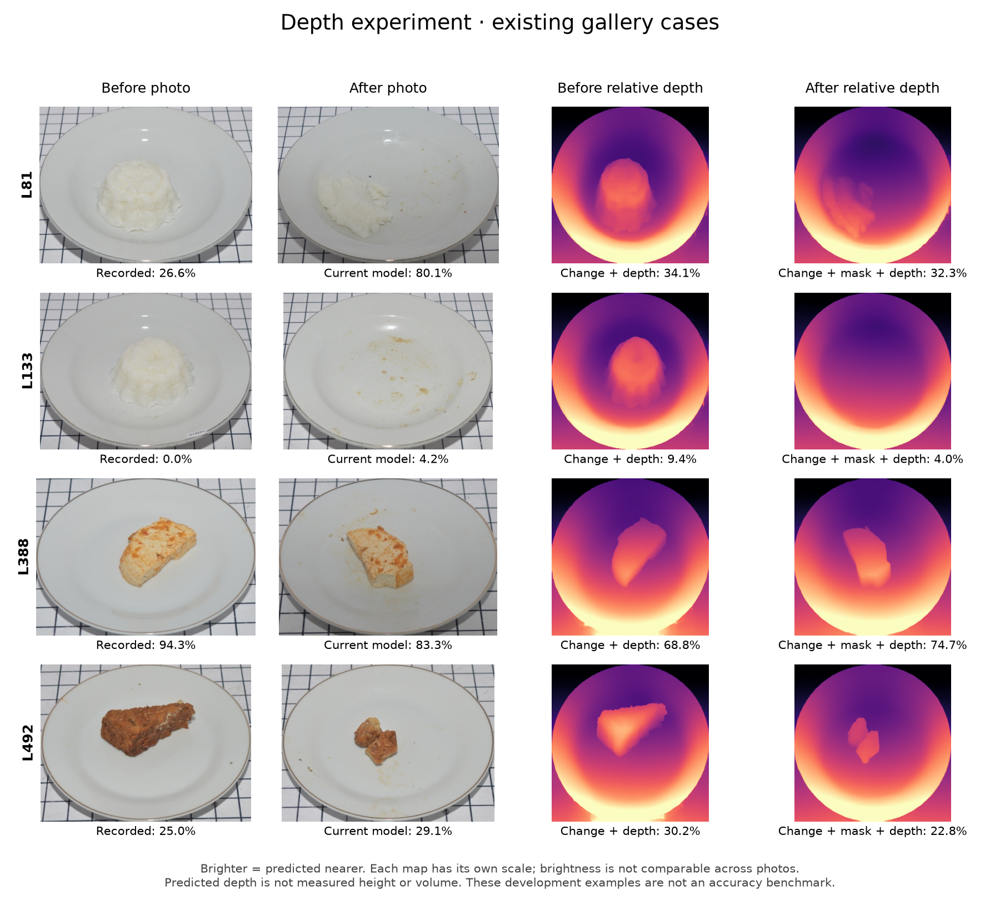

# Relative-depth experiment

This experiment adds features from a frozen depth model to the existing predictor. Neither tested depth variant improved overall LeFood error.

## Results

Evaluation: 524 pairs / 34 food groups, 50 calibration labels per outer fold. Errors are group-balanced percentage points; lower is better.

| Method | Overall error | Recorded-zero error | Small-positive error | Zero records predicted above 10% |
|---|---:|---:|---:|---:|
| Current Change model | 9.63 | 4.01 | 11.12 | 10 / 207 |
| Matched scalar-only control | 10.34 | 3.58 | 8.45 | 6 / 207 |
| Change + mask | 11.94 | 9.78 | 15.56 | 78 / 207 |
| Change + depth | 13.50 | 11.02 | 12.90 | 65 / 207 |
| Change + mask + depth | 11.99 | 9.73 | 8.18 | 52 / 207 |

The combined variant improves the small-positive slice but substantially worsens recorded-zero behavior versus the deployed baseline. Neither depth variant improves overall error over its matched no-depth control. The deployed model is unchanged.

Against the current model, the depth variant's error difference is +3.87 points (conditional paired-block 95% interval +0.24 to +7.10). Mask-plus-depth is +2.35 points (−1.45 to +4.74). All forecasts, selections and five adoption gates are saved in [the report](../reports/depth-experiment.json); neither variant passes all gates.

Extraction of 1,048 photographs took approximately 175 seconds on the local Apple GPU. Feature/selection tests cover depth scale/shift invariance, flat surfaces, raised regions, missing references and outer-label independence. Current release checks are listed in [RELEASE.md](RELEASE.md).



Possible follow-ups include learned RGB/depth fusion and measured RGB-D capture, evaluated on new servings.

## Depth blending

The [blend protocol](DEPTH-BLEND-PROTOCOL.json) fixes two policies before running them: a weighted average, and a correction that can only decrease the baseline by at most ten percentage points. Both require available local reference rings in both images. Each outer fold selects its experts and weight using its inner folds; weight zero is available. Inner selection checks recorded-zero and small-positive errors.

| Procedure | Overall error (pp) | Recorded-zero error (pp) | Small-positive error (pp) |
|---|---:|---:|---:|
| Original | 9.63 | 4.01 | 11.12 |
| Guarded weighted blend | 9.63 | 4.01 | 11.12 |
| Bounded downward correction | 10.02 | 3.94 | 10.81 |

The weighted blend selected **zero depth weight in all five folds**. The selected model therefore uses the baseline alone. The bounded correction selected weights 0, 0.1, 0, 1 and 0.5; overall error increased by 0.39 pp (conditional 95% interval −0.07 to +1.80). The original model remains deployed.

Full selections, inner candidate scores, slice results, per-group changes and outer forecasts: [blend report](../reports/depth-blend.json). Expert and weight selection reuse the same inner observations; outer forecasts evaluate the selected procedure. Blend tests check fallback, correction bounds, slice protection and independence from outer labels.

```bash
python -m foodvision.depth_blend --cache data/depth-cache/my-run \
  --mask-cache data/segmentation-cache/mobilenet-v1 --output reports/my-depth-blend.json
```

## Implementation

The official [Depth Anything V2 Small Transformers checkpoint](https://huggingface.co/depth-anything/Depth-Anything-V2-Small-hf) is pinned to revision `5426e4f0f36572d16453bbda7a8389317b1bef99`. Its three files are checksum-verified before local loading. Loading uses safetensors and disables remote code. The checkpoint's stated license is Apache-2.0. Model weights and caches are ignored by Git.

Images use the pinned processor's default aspect-preserving resize. Raw predicted inverse depth is resized to 256 × 256 and aligned with the existing predicted food mask. After per-image depth normalization, a plane fitted to the surrounding non-food ring provides a local reference. Residual statistics describe apparent shape inside the mask. The ring can include plate rims or background, which can distort the reference plane. Fewer than 32 ring pixels produces a missing-reference flag.

The features are dimensionless. Relative depth's scale/shift ambiguity prevents treating the integral as physical volume. Independent image normalization also prevents comparing raw depth brightness between photos. Both depth variants still depend on the frozen mask to locate food, even when the old area features are omitted.

## Evaluation

The original five outer LeFood test sets and 50-label fitting budgets are retained. Inner model selection and all standardization use training partitions only. Exact original-image hashes, food groups and reviewed similarity components are checked at every fitting boundary. The report also records overlap between broader dependency blocks.

Each new variant searches the same 13 candidates: a constant weighted median and 12 group-weighted RBF regressors. A scalar-only control has the same search and normalization as the depth variants; the original Change bank remains the deployed baseline. See [protocol](DEPTH-PROTOCOL.json) and the [pre-evaluation control amendment](DEPTH-EVAL-AMENDMENT.json).

Recorded-zero and small-positive mass slices are reported separately. These slices use source mass labels. Confidence intervals are conditional on the saved development forecasts.

## Reproduce

Install `requirements-depth.txt` in a separate environment. Download only `config.json`, `preprocessor_config.json` and `model.safetensors` from the pinned model revision to `models/depth-cache/small-v2/`. Expected hashes are in the protocol. Use the existing segmentation cache from [the earlier experiment](EXPERIMENTS.md).

```bash
python -m foodvision.depth --research-root ../photo-waste-feasibility \
  --mask-cache data/segmentation-cache/mobilenet-v1 \
  --output data/depth-cache/my-run --device mps
python -m foodvision.depth_experiment --cache data/depth-cache/my-run \
  --mask-cache data/segmentation-cache/mobilenet-v1 --output reports/my-depth.json
python scripts/render_depth_diagnostics.py --cache data/depth-cache/my-run \
  --report reports/my-depth.json --output reports/my-depth.png
```

Choose `cpu`, `mps` (Apple GPU) or `cuda` according to the machine. The extractor refuses to overwrite a cache and records source-image, mask, feature, map, protocol and checkpoint provenance. Failed extraction leaves an incomplete directory without a completion manifest; use a new output path for a fresh run.
