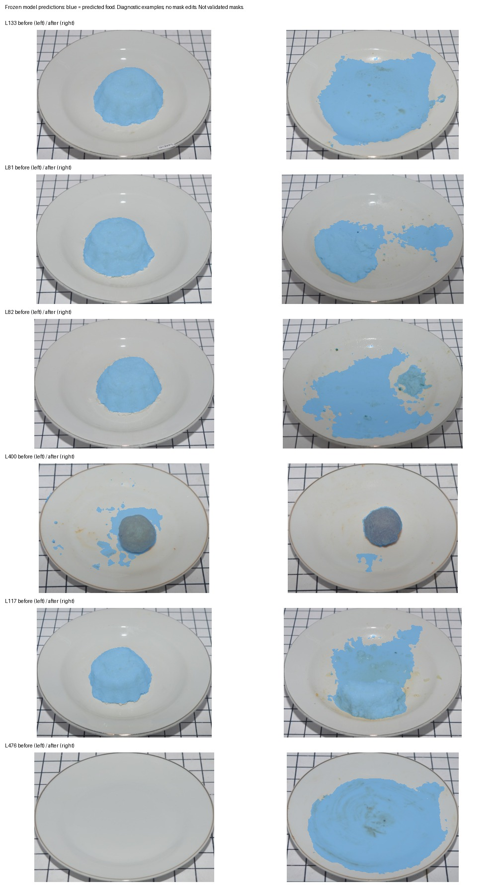

# Segmentation experiments

These experiments compare frozen food-mask features, expanded calibration budgets and a two-stage mass model with the deployed change-feature regressor.

## Outcome

Segmentation features increased LeFood error, so the deployed estimator retains the original change feature.

| Method | All 524 pairs: group MAE (pp) | Recorded-zero MAE (pp) | Small-positive MAE (pp) | Recorded zeros predicted >10% |
|---|---:|---:|---:|---:|
| Image change | 9.63 | 4.01 | 11.12 | 10 / 207 |
| Appearance | 14.65 | 6.13 | 12.36 | 47 / 207 |
| Segmentation | 15.82 | 14.47 | 15.88 | 108 / 207 |
| Combined | 11.94 | 9.78 | 15.56 | 78 / 207 |

Small-positive means recorded remaining fraction >0 and <=10% (32 pairs). Their MAE differences against image change are +6.19 pp (conditional 95% interval -0.94 to +8.74) and +2.30 pp (-2.06 to +3.91). Intervals use 2,000 paired resamples of 16 dependency blocks with the original group weighting. One block contains 18 of the 34 food groups, limiting precision.

The comparison uses all 524 source labels, the original five grouped folds and 50-label budgets. Scaling and candidate selection use training partitions. Baseline forecasts match the saved references within `1e-10`.

The [frozen protocol](SEGMENTATION-PROTOCOL.json) was saved before extraction/evaluation. A [documented amendment](SEGMENTATION-AMENDMENT.json) corrects an overly strict dependency-block check: the original protocol purges record-level similarity components at fitting boundaries and uses broader group-union blocks for uncertainty. The first run stopped before scoring; original folds and all feature/model choices stayed fixed. Raw image SHA256, record, food-group and similarity-component separation are checked at every inner and outer boundary. The source data do not identify servings beyond these links.

Full forecasts, selections and metrics: [experiment report](../reports/segmentation-experiment.json).

## Mask inspection

The frozen [DeepLabV3Plus/MobileNetV2 checkpoint](https://huggingface.co/mawiie/food-segmentation-mobilenet) has 104 classes; any non-background argmax is treated as predicted food. In the six preselected diagnostic cases, it often includes rice residue and stained plate areas. This helps explain why area features are unsuitable without better mask quality. Overlays use the segmenter’s raw class predictions.



Mask IoU was not measured because this collection lacks annotated masks. The checkpoint model card lists MIT and identifies FoodSeg103 as its training source. The repository excludes the checkpoint and FoodSeg103 data.

## Source review

Automated visual screening covered 524 pairs on 22 contact sheets, with IDs and photos but no displayed weights or predictions. The recorded categories were visible food-like material (285), residue/crumbs/no clear portion (205), and uncertain (34). Some images had already been inspected during diagnostics.

Comparing these categories with source measurements produced 48 review priorities: 34 ambiguous cases and 14 possible label conflicts. Those cases need source verification; the experiment uses the original mass labels.

[Review queue](../reports/review-queue/review-queue.json) · [Screening codes and rubric](../reports/ai-review/page-proposals.json) · [Conflict photos, page 1](../reports/review-queue/source-conflict-proposals-01.jpg) · [Page 2](../reports/review-queue/source-conflict-proposals-02.jpg)

## Reproduction

Run from the repository root with the original LeFood photographs in the research-root layout. Create a separate environment for extraction:

```bash
python3.12 -m venv .venv-segmentation
.venv-segmentation/bin/python -m pip install -r requirements-segmentation.txt
```

Download `best_model.pth` from revision `93d8c84b121ecce76ed752be538e01d72df15825` of `mawiie/food-segmentation-mobilenet` into `models/segmentation-cache/`. Expected SHA256: `6ecc4da2210d8a2128f6a79670d40f25c8f5ffbf11b3358689669c431896600f`. Loading verifies the checksum and uses restricted `weights_only=True` state-dict loading. The 512-square full-frame resize differs from the author's validation center crop; this transfer choice was fixed before evaluation. The experiment uses the raw argmax mask.

```bash
.venv-segmentation/bin/python -m foodvision segment-cache \
  --research-root ../photo-waste-feasibility --output data/segmentation-cache/my-run
python -m foodvision segmentation-experiment \
  --cache data/segmentation-cache/my-run --output reports/my-segmentation.json
python scripts/build_review_queue.py \
  --research-root ../photo-waste-feasibility \
  --proposals reports/ai-review/page-proposals.json \
  --manifest data/segmentation-cache/my-run/manifest.json --output reports/my-review-queue
```

Extraction processes 1,048 images, stores 19 paired mask features, original image provenance, model revision/checksum, environment versions and feature/protocol checksums. The recorded CPU extraction took about 554 seconds.

## Sample overlays

The repository includes cached masks for all four sample pairs. `scripts/export_sample_overlays.py` renders eight bundled overlays from the existing cache and records image/model provenance in `examples/overlay_manifest.json`. These cached overlays are displayed for sample pairs on the website, separately from the percentage estimator.

## Expanded training and zero-mass modeling

Both experiments retain the original outer test IDs and source targets.

| Model | LeFood error (points) | ACETADA error (points) |
|---|---:|---:|
| Original Change, 50 calibration pairs | 9.63 | 9.46 |
| Change, expanded training pool | 9.75 | 8.39 |
| Appearance, expanded training pool | 11.07 | 7.82 |
| Two-stage mass model, 50 pairs | 9.46 | 9.03 |
| Two-stage mass model, expanded pool | 11.46 | 7.77 |

Expanded training uses 353–462 LeFood pairs and 621–650 ACETADA pairs per fold. Outer and inner fitting boundaries exclude shared groups/similarity components; LeFood additionally excludes exact raw image hashes across before/after roles. Inner partitions are constructed without using target values. The two-stage model learns a positive-mass score from after-image embeddings and a conditional amount model from positive-mass training records. Their product predicts remaining fraction.

No tested LeFood candidate passed all predeclared adoption gates. In particular, the 50-pair two-stage result improves error by only 0.18 points, with a paired block interval crossing zero. For L81, it predicts 64.7% versus 26.6% recorded, compared with the original 80.1%. Overall results did not meet the adoption criteria, so the original estimator remains deployed.

Reproduce with:

```bash
python -m foodvision.data_budget reports/my-data-budget.json
python -m foodvision.hurdle reports/my-hurdle.json
```

The hurdle run uses the checked-in `reports/data-budget.json` for its expanded partitions and records that report’s hash. Protocols are `docs/DATA-BUDGET-PROTOCOL.json` and `docs/HURDLE-PROTOCOL.json`; full forecasts, selections, slices and intervals are in the matching reports. Tests check target independence, group/image purging and the no-positive-label edge case.

## Relative-depth follow-up

The subsequent [depth experiment](DEPTH.md) evaluated Depth Anything V2 Small features over all 524 LeFood pairs with the original nested splits. Change + depth reached 13.50 pp; Change + mask + depth reached 11.99 pp, versus 9.63 pp for the current estimator. The report includes matched controls and errors for recorded-zero and small-positive cases.
